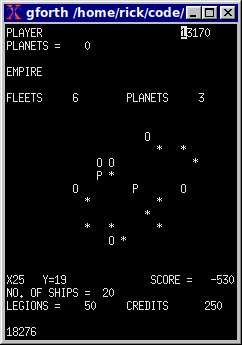

# Cosmic Conquest 1982

This is a re-creation of a [realtime strategy game published in BYTE Magazine in 1982](https://archive.org/details/byte-magazine-1982-12/page/n131/mode/1up?q=cosmic+conquest). The original version of the game was distributed in printed form for users to manually type into their Apple II computers. It is credited as one of the first realtime strategy computer games. The game was authored in a flavor of FIGForth for the Apple II, possibly FIGForth '78. The exact platform is unknown at this time.

Attempts at emulation have not gone well because we cannot determine the exact Forth version originally used. The source code has been updated to run on a modern Forth system (GForth).

# Contents of This Repo

 * `pages/` - Individual listing for each page as they appeared in the magazine.
 * `cosmic_conquest.fs` - A historic listing of the unmodified source code.
 * `cosmic_conquest_modern.fs` - "40th Anniversary Edition". A modernized version of the game, playable on GForth.

# How to Run

1. Install [GForth](https://gforth.org/). Nearly any version will work and it is verified to work on GForth >= 0.7.3
1. Run the source code via `gforth cosmic_conquest_modern.fs`.
1. Once GForth is running, type `CONQUEST` to start the game.

# How To Play

**COMMANDS ARE CASE SENSITIVE.** In the original Apple II, this did not matter. On modern systems, it does. Keep that in mind as you enter commands.

When you open the game, you will be prompted to press "any key" twice. This is used for generation of a random seed and will afffect the structure of the game's universe.

Key controls:

 * `W`, `Z`, `A`, `S` - Directional controls
 * `T` - **T**ax your planets
 * `L` - **L**and on a planet
 * `I` - **I**nformation
 * `F` - **F**ire / attack enemy
 * `O` - Switch to **O**ther fleet

[Full instructions are available in the original magazine article.](https://archive.org/details/byte-magazine-1982-12/page/n125/mode/2up)

# Research and Resources

 * **NEW:** Reddit user /u/tmrob4 has created a [new fork of the game that is more playable](https://www.reddit.com/r/Forth/comments/qmx75f/enhanced_version_of_cosmic_conquest_a_forth_based/)
 * The game appears to have been [re-written to run on the Cosmac ELF](http://cosmacelf.com/publications/newsletters/ipso-facto/ipso-facto-42.pdf) rather than an Apple II (FIG-Forth).
 * To date, no one in the Forth community is sure which Forth system this was suposed to run on, nor can a compatible system be found. Byte Magazine does not specifically say (?).

# Contributors

Special thanks goes to the folks who made this restoration possible:

 * Alan Sartori-Angus - Original author of the game in 1982.
 * [Gordon JC Pearce](https://github.com/gordonjcp) - Ported the historic 1982 source code to GForth.
 * [tmr4](https://github.com/tmr4) - Data entry of original sources.
 * [Rick Carlino](https://github.com/RickCarlino/) - Documentation, proofing, data entry.

# How to Help

Much information about the game and the circumstances leading to its publication are still unknown. We have not yet been able to run the original version as it appeared in print.

Any background information about the game or how it can be run on the original platform are appreciated.
